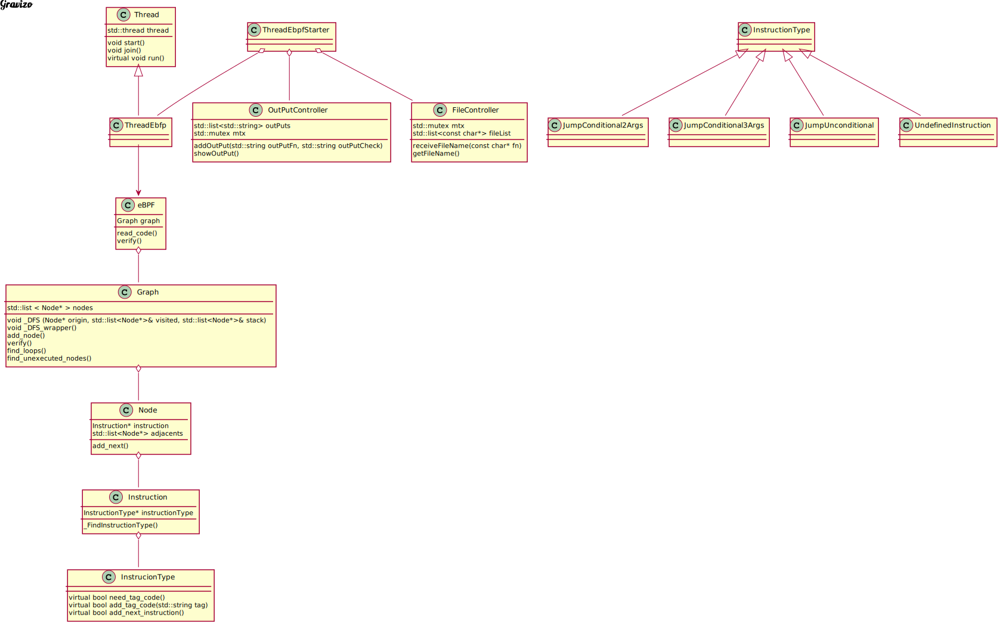

# TP2---Taller-de-prog---eBPF
# Alumna: Azul Zaietz
# Padrón: 102214

En este trabajo se implementa un programa que actúa como verificador de programas eBPF. Se leen los archivos pasados por línea de comandos, se los analiza y el verificador aclara si encontró bucles o instrucciones sin ejecutar, en caso contrario devuelve "GOOD". Los archivos serán procesados en la cantidad de hilos especificados en la línea de comandos. 

El siguiente informe detalla información relevante del proceso de desarrollo del programa: su esqueleto, diagramas de flujo y soluciones a algunos problemas presentados.

# DISEÑO

Antes de implementar la solución, se empezó por diseñarla, planteando las diferentes estructuras del programa y cómo iban a relacionarse entre sí. 

El diseño se pensó usando como base la programación orientada a objetos.

En un principio se plantearon los siguientes:

- GRAFO: un TDA grafo con los metodos necesarios para poder agregar un nodo y realizar un recorrido DFS para poder verificar la estructura del programa eBPF.

- NODOS: un TDA nodo que permitiera almacenar la instruccion correspondiente al nodo y tener una lista de sus adyacentes, para poder brindar la informacion necesaria al grafo al hacer el recorrido DFS.

- INSTRUCCIÓN: un TDA cuya funcion es almacenar un tipo de instruccion y brindar los datos correspondientes al nodo de forma polimorfica.

- TIPO DE INSTRUCCIÓN: TDA padre para todas las instrucciones, clase de la cual van a heredar:
    - Jump condicionales con 2 argumentos
    - Jump condicionales con 3 argumentos
    - Jump incondicionales
    - Ret
    - El resto de las instrucciones con el mismo comportamiento entre si

- EBPF: TDA que guarda una instancia de grafo y cuyos metodos son leer un archivo para crear el grafo y luego verificar el programa.

- HILO: TDA generico con los metodos para hacer funcionar un hilo de ejecución.

- HILO EBPF: TDA que hereda del hilo generico con el metodo "run()" correspondiente (sobreescrito) para procesar el programa eBPF.

- CONTROLADOR DE ARCHIVOS: este TDA cumple la funcion de almacenar todos los archivos pasados en la línea de comandos y bloquear el mutex mientras un hilo accede a alguno de los nombres de archivo guardados en la lista para que todos los archivos sean procesados correctamente por algun hilo. Una vez que el hilo recibio el nombre de archivo, lo borra de la lista de archivos a procesar y desbloquea el mutex.

- CONTROLADOR DE SALIDA: bloquea el mutex para que la ejecucion de lo hilos no se superpongan hasta que se haya guardado correctamente la salifda correspondiente a la verificacion de un archivo. Guarda las salidas en una lista para luego mostrarlas una vez que todos los archivos hayan sido procesados. Una vez que la salida fue guardada correctamente desbloquea el mutex.

# IMPLEMENTACIÓN

Durante la implementación se agregó un nuevo TDA para abstraer el código de la lectura de la linea de comandos y del inicio y ejecución de los hilos del main.

## Diagrama de secuencia: Un hilo procesa un archivo

Se representa el caso particular en el que se pide procesar un archivo de programa eBPF con un solo hilo.

# Diagrama de clases representativo de la solución final:

